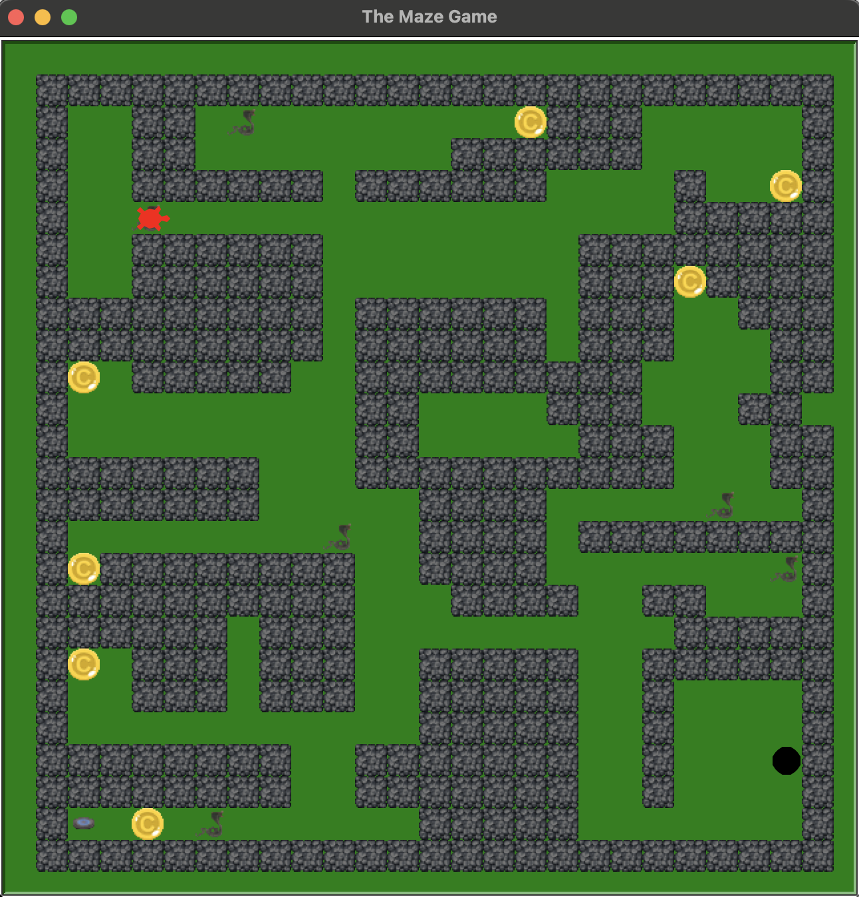
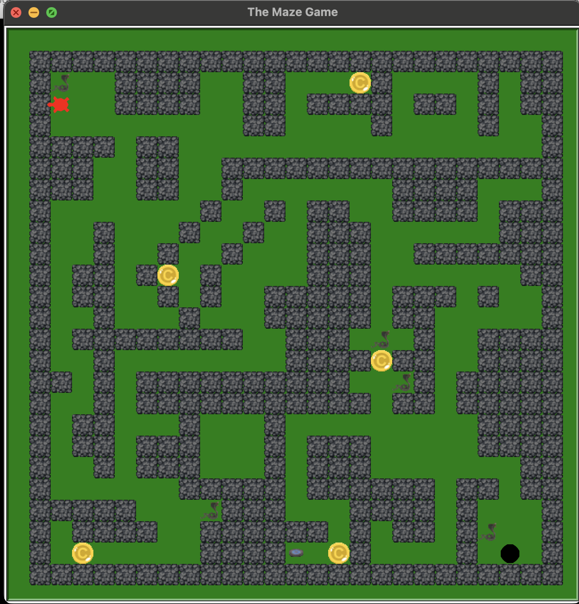

# 🐍 Python Maze Game

A two-level interactive maze game developed using **Python and Turtle** during my Software Development apprenticeship.

This was my first substantial programming project and one of the projects that helped develop my interest in software development.

> This repository preserves the project largely as it was originally developed. Earlier versions have also been retained to show how the application evolved during development.

---

## 🎮 About the Project

The Maze Game is a grid-based game where the player navigates through maze levels while collecting items, avoiding threats and progressing through the game.

The project was developed incrementally, with functionality added and tested throughout the development process.

### Features

- Two playable maze levels
- Grid-based player movement
- Wall and collision detection
- Score and gold collection
- Moving threats
- Proximity-based enemy behaviour
- Level progression
- Custom game assets
- Object-oriented game components

---

## 🛠️ Built With

- **Python**
- **Turtle**
- Object-oriented programming
- Collision and movement logic
- Grid-based level design

---

## 📸 Screenshots

### Level 1



### Level 2



---

## 🧠 Development

This project was originally completed during my Software Development apprenticeship and was one of my earliest substantial programming projects.

Development was carried out incrementally, with multiple versions created as new functionality was introduced and tested.

Earlier versions of the project are preserved in the [`development-history`](development-history/) directory.

The final apprenticeship version is available in [`src`](src/).

---

## 📂 Repository Structure

```text
python-maze-game/
│
├── src/
│   └── maze_game.py
│
├── development-history/
│   ├── maze_game_v1.py
│   ├── maze_game_v2.py
│   ├── ...
│   └── maze_game_v4_2.py
│
├── docs/
│   ├── maze-game-level-1.png
│   └── maze-game-level-2.png
│
└── README.md
